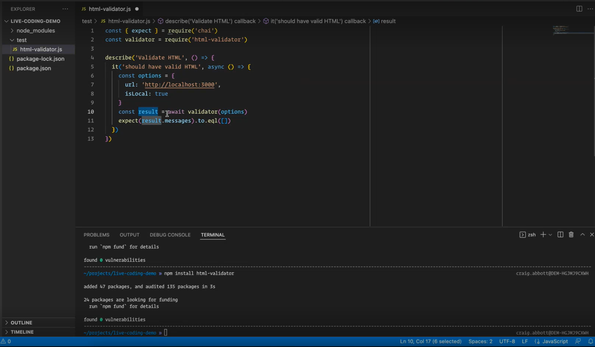
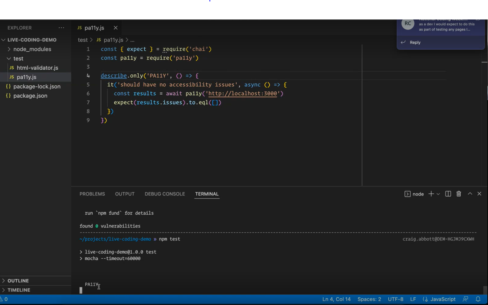

# ARIA, Announcements and Alerts

WAI-ARIA Web Accessibility Initiative Accessible Rich Internet Applications

ARIA modifies Accessibility Tree which is what assistive technology uses to present content to users.  The accessibility tree is built automatically by the browser using HTML code.

To view the accessibility tree
1 Open Devtools Chrome 
2. Choose Accessibility Tab
3. Turn on enable full page accessibility tree
4. Restart Browser

**5 ARIA Rules/Guidelines**

1. Try not to use ARIA
2. Try not to change native semantics
3. All interactive contorls must work with a keyboard
4. Dont hide elements which can still be focused
5. All elements must have an accessible name

https://www.w3.org/TR/using-aria/

**Aria has 3 Main Categories**

Roles - main identity of element
Staes and Properties - Widget attributes, live region attributes, relationship attributes
Live regions

#Automated Testing

**Test in Command Line**

`$npm html-validator-cli`

`$html-validator --file=<file to path>`

`$html-validator <url>`

Use --verbose to get full report
Use --islocal for locally hosted websites

**3 tools can pick up 40% of issues**

ARC Toolkit – chrome turn on local files in options

AxeDev Tools – chrome turn on local files in options

Wave – chrome turn on local files in options

**Additional Useful Tools**

WCAG - Contrast Checker

Accesibility  Insights

Broken Link Checker

Web Developer Tools

https://accessibility-manual.dwp.gov.uk/tools-and-resources/basic-accessibility-checks

1. Test HTML is valid for the page as you build it.
2. Use the browser ools against the page as you build it
3. Run your acceptance tests against the page before manual accessibility checks
4. Manually test the page against WCAG 2.1
5. Manually test the page using assitive technologies
6. Run your acceptance tests against the whole product before merging your code

`$npm html-validator install`

`$npm html-pally install`

